# Droplet ML  

## Introduction  
Droplet ML is a project focused on detecting the contact angle of a liquid droplet on a surface. The project utilizes computer vision techniques to identify the droplet's shape, fit an elliptical model, and compute the contact angle by determining the tangents at the intersection points between the droplet and the surface.  

[_COMPLETE CODE HERE_](https://github.com/alesarritz/droplet-ml)

## Section 1: Droplet Detection with OpenCV on Synthetic Dataset

In this section, OpenCV is used for Droplet Detection through Elliptical Fitting. 
The following technique has been applied to the dataset in the _dataset_120_ folder.

#### Methodology

- **Shape Detection (Elliptical Fitting)**: The algorithm processes grayscale images to detect the droplet. It first identifies the surface on which the droplet rests and then fits an ellipse to the detected contour of the droplet.  
- **Tangent Calculation & Angle Measurement**: Once the ellipse is detected, the algorithm identifies the intersection points between the ellipse and the surface. The tangent lines at these points are computed, and their angles with respect to the surface are determined.  

#### Observations

- **Strengths**: The OpenCV-based method consistently detects the surface on which the droplet rests, providing a reliable reference for angle measurement. In clean and well-lit scenarios, the ellipse fitting algorithm can accurately outline the droplet shape.
- **Limitations**: The elliptical fitting often fails in challenging conditions, such as when the droplet has low contrast with the background or is partially occluded. As a result, the contact angle computation becomes imprecise due to inaccurate tangent estimation at the droplet's edge.

#### Code
The related code can be found in the folder `1. OpenCV Droplet Detection`

#### Example Outputs
```
Expected angle: 110°

Saved: output_tangents\110.0_0.0_1.0_0.0_.png - Angle1: 110.1°, Angle2: 110.14°
```


<br>

---

```
Expected angle: 160°

Saved: output_tangents\160.0_0.5_1.0_0.0_.png - Angle1: 128.85°, Angle2: 129.03°
```

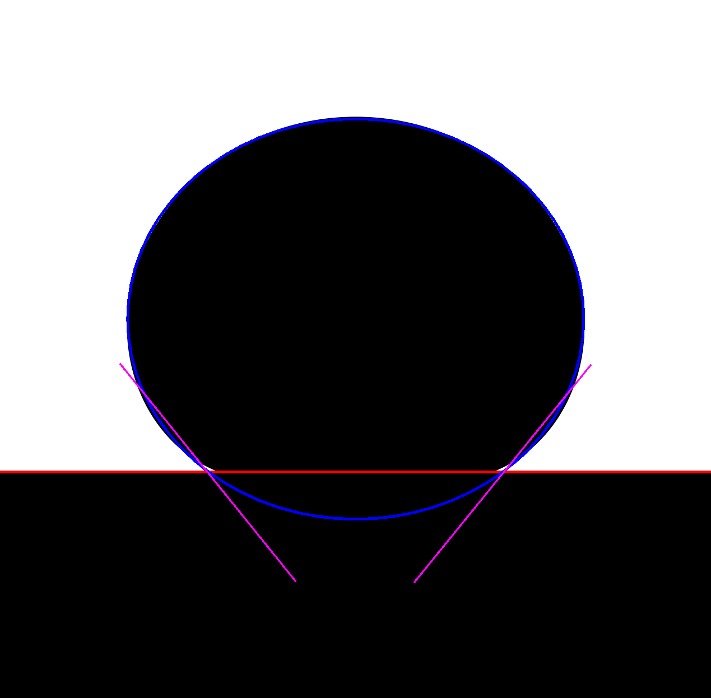

<br>

---

```
Expected angle: 180°

Saved: output_tangents\180.0_2.0_6.0_0.0_.png - Angle1: 111.95°, Angle2: 114.8°
```
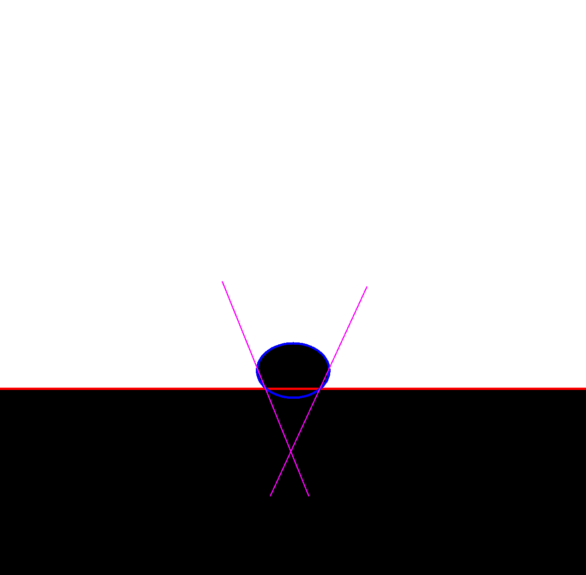

<br>


## Section 2: Droplet Segmentation with Meta's SAM model

In this section, we explored the use of [Meta's Segment Anything Model (SAM)](https://github.com/facebookresearch/segment-anything) to automatically segment droplets in real-world images. The goal was to overcome the limitations of traditional OpenCV-based methods by leveraging SAM's advanced transformer-based segmentation capabilities.

#### Methodology

- **Model & Inference**: We used the `vit_h` variant of SAM and the official pre-trained checkpoint. For each image, we applied the `SamAutomaticMaskGenerator`, which produces multiple candidate masks based on visual features.
- **Visualization & Saving**: Each mask was randomly colored and overlaid onto the original image to visualize segmentation. The masks were saved as RGB images with clearly separated segments using OpenCV.

#### Observations

- **Strengths**: SAM demonstrated strong segmentation capabilities in complex visual contexts, even with variable lighting and textured backgrounds. In many cases, it successfully isolated the droplet region with high precision.
- **Limitations**: The model tends to over-segment — producing numerous masks for irrelevant regions (e.g., background elements, shadows, reflections). This behavior introduces noise and requires post-processing or mask filtering to isolate the actual droplet.

#### Code
The related code can be found in the folder `2. SAM model`

#### Example Output
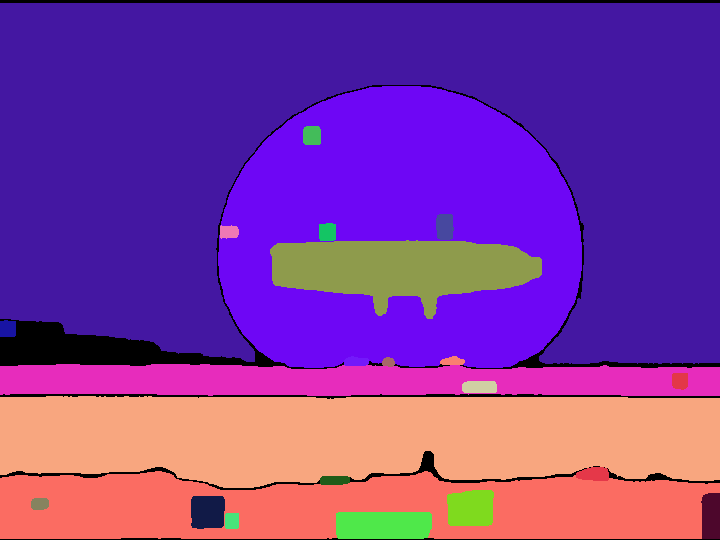


## Section 3: Segmentation and Detection Models

The code related to this section can be found in the folder `3. Segmentation and Detection Models`

### Phase 1: Segmentation and Dataset Preparation

---

This phase prepares a high-quality, labeled dataset for training deep learning models on droplet detection and segmentation. It includes raw frame extraction from video, pixel-wise preprocessing, semantic mask creation, and annotation generation in formats compatible with U-Net, YOLO, and R-CNN-based architectures.

The code related to this section can be found in the notebook `DropletML - Segmentation & Dataset Prep.ipynb`

#### Step 1: Extract Frames from Video

A total of 5,000 frames were evenly sampled from a 43 minutes and 34 seconds video (recorded at 30 FPS). This corresponds to one frame every ~0.5 seconds. OpenCV was used to extract and save these frames as images.

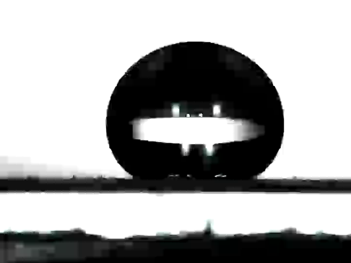

#### Step 2: Apply Thresholding to Clean the Images

Each extracted frame is converted to grayscale and thresholded. Pixels darker than a certain value are turned black (potential droplet), and others are turned white (background). This binary image is the basis for identifying the droplet.

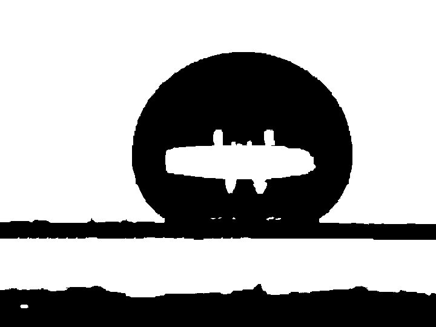

#### Step 3: Color Surface

A blue rectangle is drawn on the bottom third of the image to denote the known surface location. This artificial label simplifies later class separation between droplet and surface.

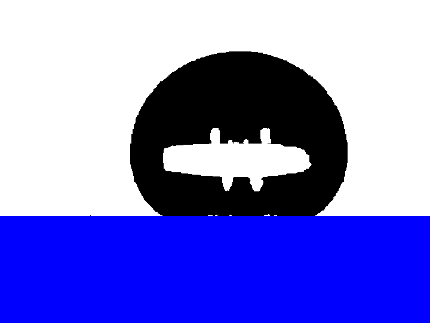

#### Step 4: Color the Droplet

Dark regions from Step 2 are colored **magenta** to indicate potential droplet pixels. This step visually distinguishes the droplet from background and surface, preparing for mask generation.

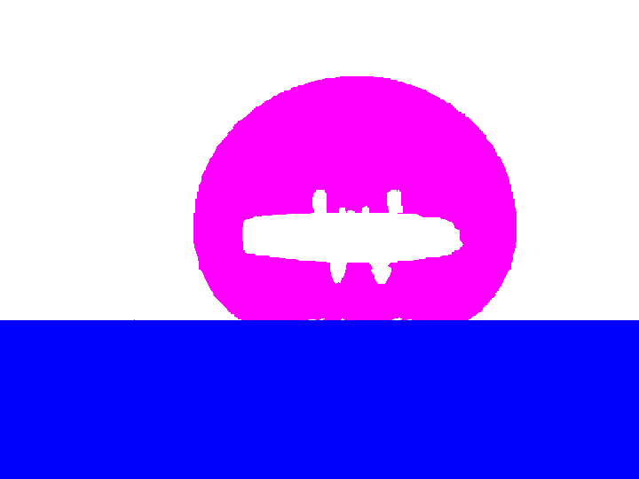

#### Step 5: Fill the Droplet

Contours are used to fill the interior of the droplet, and custom neighborhood rules are applied to improve consistency:
- **Step 1**: Fill missing parts of the droplet.
- **Step 2**: Remove outliers.
- **Step 3**: Keep only the largest magenta blob to ensure a single droplet per image.

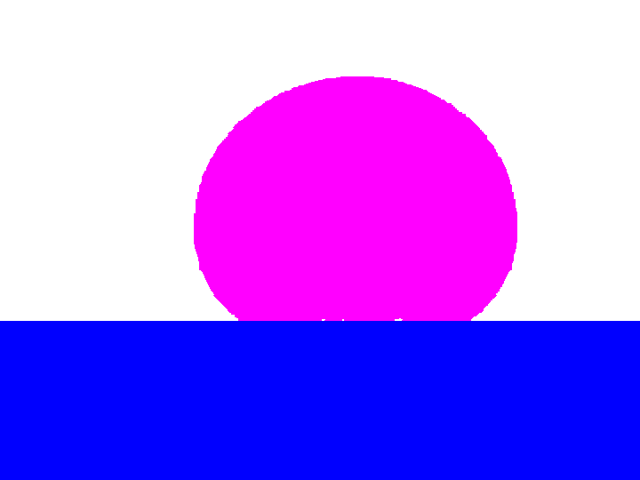

#### Step 6: Generate Segmentation Masks (for U-Net / DeepLabV3+ / YOLACT)

Each image is converted to a **single-channel grayscale mask**:
- 0 → background  
- 1 → droplet (magenta)  
- 2 → surface (blue)

These masks are saved in `segmentation_masks/` and are used for semantic segmentation training.

_Step 6.1: Create Binary Masks_

From the 3-class segmentation masks, two binary masks are derived:
- `droplet_masks/`: white pixels only where the droplet is present.
- `surface_masks/`: white pixels only where the surface is present.


#### Step 7: Generate labeled files for YOLO / R-CNN / Faster R-CNN (Object Detection)

_Step 7.1: Generate labels for YOLO_

Each mask is analyzed to generate **YOLO-format `.txt` files** containing bounding boxes for:
- class 0 → droplet
- class 1 → surface

_Step 7.2: Generate COCO JSON for R-CNN / Faster R-CNN_

Each segmentation mask is converted into a **COCO-compatible annotation**:
- Includes image size, filename, and bounding boxes for each object.
- Saved as a single file: `coco_annotations.json`.


### Phase 2: U-Net Model

---

This phase focuses on training and evaluating a semantic segmentation model based on the U-Net architecture. The model is trained to distinguish between **background**, **droplet**, and **surface** in the preprocessed dataset created in Phase 1.

The code related to this section can be found in the folder `U-Net`. In particular, design, training and testing of the model can be found in the `DropletML_U_Net.ipynb` notebook, while a script to use the trained model can be found in `unet_prediction.py`

#### Step 1: Initialization

The training pipeline is initialized by importing key libraries, setting global paths, and specifying that there are **3 segmentation classes**:
- 0 = background
- 1 = droplet
- 2 = surface

The dataset is extracted from `processed_data.zip`, ensuring all necessary image and mask folders are available.

#### Step 2: Custom Dataset

A custom PyTorch `Dataset` class, `UNetSegmentationDataset`, is defined to load input images and corresponding segmentation masks. Both are resized to a fixed resolution of **(180, 240)** and converted to tensors. Masks are converted to `LongTensor` format, as required for `nn.CrossEntropyLoss`.

The dataset is split **80/20** into training and testing subsets, and loaded using `DataLoader` with `batch_size = 8`.


#### Step 3: Define U-Net Model

A compact but powerful **U-Net** is implemented. It features:
- A convolutional **encoder** with max-pooling layers to downsample the image and capture features.
- A **middle bottleneck** block to learn abstract representations.
- A **decoder** with bilinear upsampling and convolution layers to recover spatial resolution.

The model outputs a tensor of shape `(N, 3, H, W)` where each channel represents class logits.

#### Step 4: Training

The model is trained for 30 epochs using:
- **Loss**: `CrossEntropyLoss` for multi-class segmentation.
- **Optimizer**: Adam with an initial learning rate of `1e-3`.
- **Learning Rate Scheduler**: Reduces LR if the validation loss plateaus.
- **Mixed Precision Training**: Implemented using `torch.cuda.amp` for faster training on GPUs.

During each epoch, the training loss is logged, and evaluation metrics are computed on the test set:
- **IoU (Intersection over Union)** per class
- **Dice Score** per class

All metrics are tracked across epochs for performance monitoring.

#### Step 5: Testing and Visualization

After training, the model is evaluated on test samples:
- For each test image, the **input**, **ground truth mask**, and **predicted mask** are visualized side-by-side.
- A maximum of **10 samples** are shown for qualitative analysis.

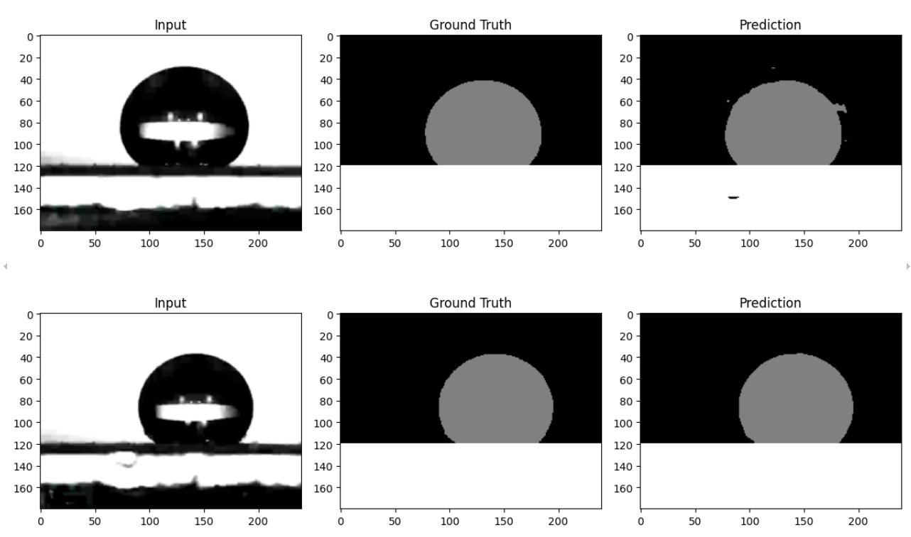

Additionally, three training curves are plotted:
- Average training loss per epoch
- Mean IoU per epoch
- Mean Dice score per epoch

These plots provide insight into training stability, convergence, and model accuracy.

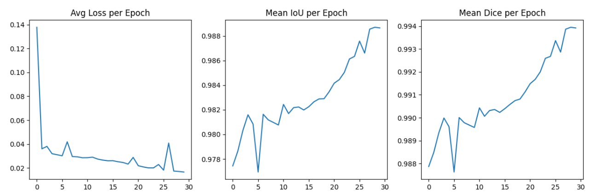

#### Step 6: Model Saving

The trained model is saved to disk as `unet_model.pth`, allowing it to be reused for inference and evaluation in future phases.

#### Step 7: Model Use

In order to make the use of the trained model practical, the `unet_prediction.py` script was created. It applies the trained U-Net model to all images in a given folder and for each image, it generates:

- A **grayscale prediction mask** (with 0 = background, 127 = droplet, 255 = surface) saved in `predictions/`
- A **binary droplet-only mask** (white = droplet, black = background) saved in `droplet_unet/`


### Phase 3: Other models in development...

---

YOLO, DeepLabV3+


## Section 4: Segmented Images Processing

The code related to this section can be found in the folder `4. Segmented Images Processing`.

This phase analyzes droplet masks over time to measure shape evolution and geometric properties. All operations are compatible with:
- OpenCV-based masks
- U-Net-predicted masks 

From the 5,000-frame dataset (sampled every 0.5 seconds from the original video), we extract **1 frame every 500** for temporal analysis, resulting in one frame approximately every **4 minutes and 10 seconds**.

### Droplet Subtraction Over Time

---

For each frame `n`, we compute:
- The **difference** between the current mask and the previous (`n-1`) and first frame (`0`)
- The **volume loss** as the percentage decrease in the number of non-zero pixels

This helps identify how the droplet evaporates or morphs over time.

#### Example Outputs – OpenCV:
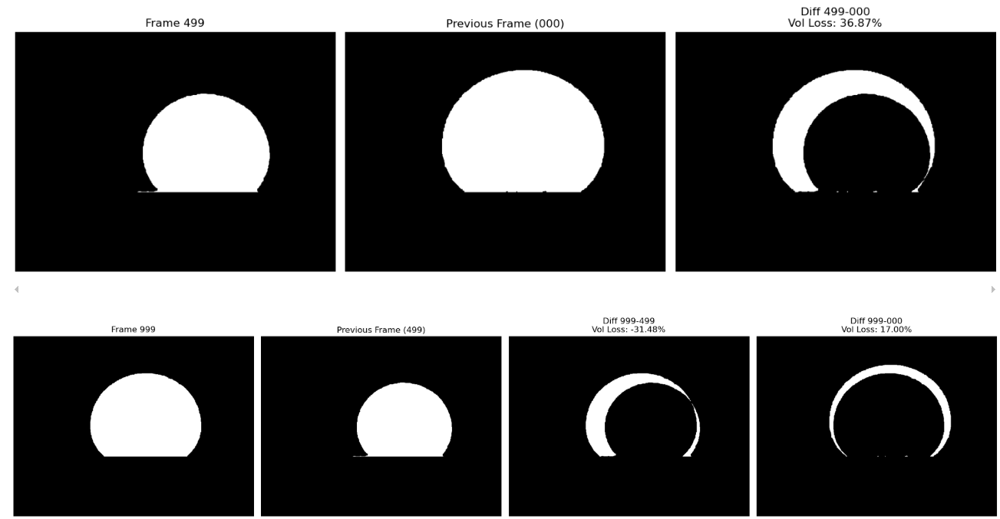

#### Example Outputs – U-Net:
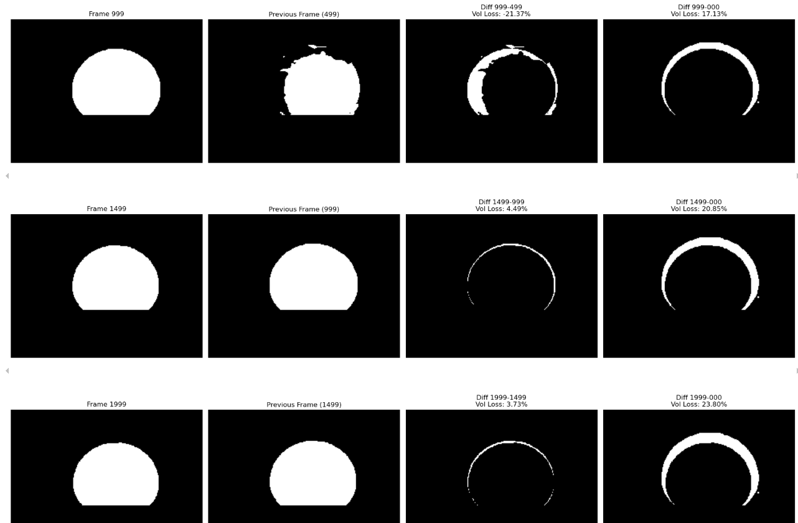


### Bounding Box Detection

---

For each sampled mask, we detect the **largest contour** and compute its **bounding box**. This bounding box serves as a compact geometric descriptor for the droplet's position and extent over time.

#### Example Outputs – OpenCV:
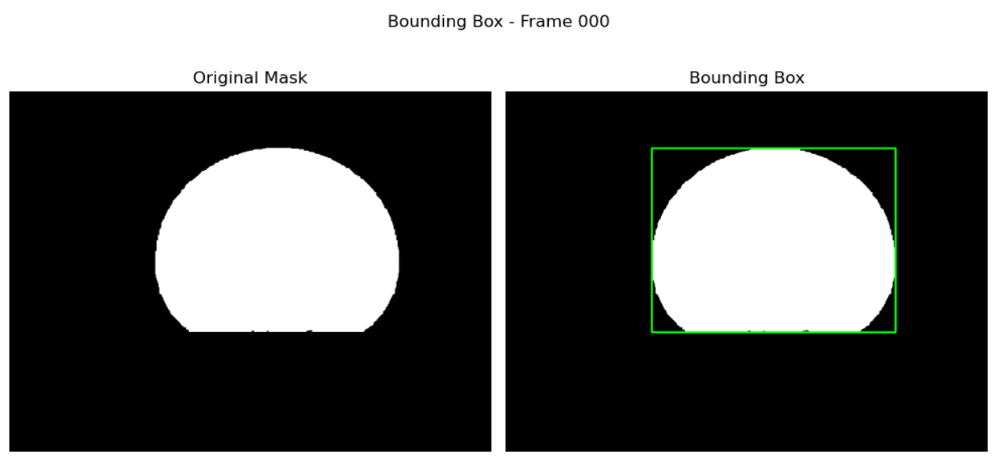


#### Example Outputs – U-Net:
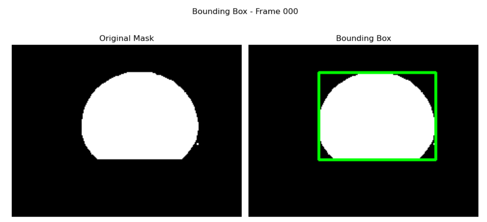
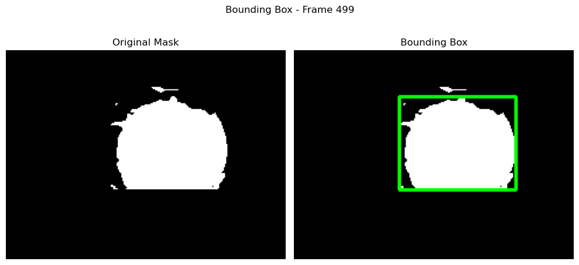

